<div align="center">

<!-- ═══════════════════════════════════════════════════════════ -->
<!--                        HEADER                              -->
<!-- ═══════════════════════════════════════════════════════════ -->

<picture>
  <source media="(prefers-color-scheme: dark)" srcset="./header-dark.svg" />
  <source media="(prefers-color-scheme: light)" srcset="./header-light.svg" />
  
</picture>

<br/><br/>

<a href="https://github.com/rieckt">
  
</a>

<br/><br/>

<a href="mailto:timlouis.rieck@gmail.com">
  
</a>
&nbsp;&nbsp;
<a href="https://github.com/rieckt">
  
</a>

</div>

<br/>

<!-- ═══════════════════════════════════════════════════════════ -->
<!--                        ABOUT                               -->
<!-- ═══════════════════════════════════════════════════════════ -->

<table>
<tr>
<td width="55%" valign="top">

### `~/about`

```yaml
name: Tim-Louis Rieck
role: Full Stack Developer
location: Germany

focus:
  - Digital Twin Platforms
  - Modern Web Architecture
  - Developer Tooling

currently_building: Loumi
```

</td>
<td width="45%" valign="top">

### `~/languages`

<br/>


</td>
</tr>
</table>

<br/>

<!-- ═══════════════════════════════════════════════════════════ -->
<!--                      FEATURED                              -->
<!-- ═══════════════════════════════════════════════════════════ -->

<div align="center">

### Featured

<br/>

<table>
<tr>
<td align="center" width="50%" valign="top">

**[loumi-app](https://github.com/rieckt/loumi-app)**

Digital Twin Platform für Wärmepumpen-Beratung

`Next.js 16` `React 19` `TypeScript`
`Convex` `Turborepo` `Tailwind CSS`

</td>
<td align="center" width="50%" valign="top">

**[create-loumi-app](https://github.com/rieckt/create-loumi-app)**

CLI Scaffold Tool für Loumi-Projekte

`TypeScript` `Commander` `Node.js`
`Convex` `Better Auth` `Sanity`

</td>
</tr>
</table>

</div>

<br/>

<!-- ═══════════════════════════════════════════════════════════ -->
<!--                       STACK                                -->
<!-- ═══════════════════════════════════════════════════════════ -->

<div align="center">

### Stack

<br/>

**Frontend**


<br/><br/>

**Backend & Data**


<br/><br/>

**Tools & Infra**


</div>

<br/>

<!-- ═══════════════════════════════════════════════════════════ -->
<!--                      ACTIVITY                              -->
<!-- ═══════════════════════════════════════════════════════════ -->

<div align="center">

### Activity

<br/>


<br/>


<br/><br/>

<picture>
  <source media="(prefers-color-scheme: dark)" srcset="https://raw.githubusercontent.com/rieckt/rieckt/output/github-snake-dark.svg" />
  <source media="(prefers-color-scheme: light)" srcset="https://raw.githubusercontent.com/rieckt/rieckt/output/github-snake.svg" />
  
</picture>

</div>

<br/>

<!-- ═══════════════════════════════════════════════════════════ -->


