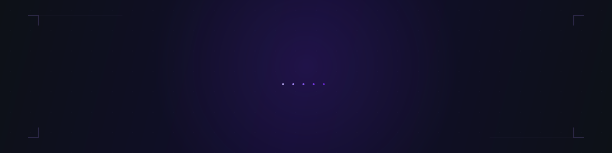

<picture>
  <source media="(prefers-color-scheme: dark)" srcset="./header-dark.svg" />
  <source media="(prefers-color-scheme: light)" srcset="./header-light.svg" />
  
</picture>

 

Digitale Zwillinge, moderne Web-Architektur, Developer Tools. 
Aktuell: [**Loumi**](https://github.com/rieckt/loumi-app) — Digital Twin Platform für Wärmepumpen-Beratung.

 

<table>
<tr>
<td width="50%">

**[create-loumi-app](https://github.com/rieckt/create-loumi-app)** 
CLI Scaffold Tool für Loumi-Projekte 
TypeScript · Commander · Node.js

</td>
</tr>
</table>

 

`Next.js` · `React` · `TypeScript` · `TanStack` · `Astro` · `Node.js` · `Convex` · `Vercel`

 

<a href="mailto:timlouis.rieck@gmail.com">timlouis.rieck@gmail.com</a>

