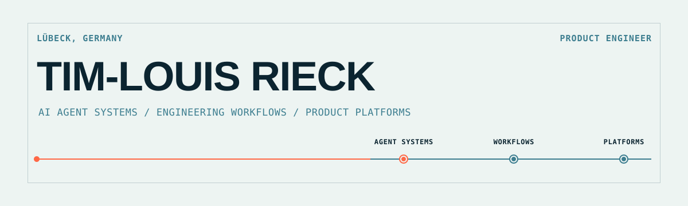

<picture>
  <source media="(prefers-color-scheme: dark) and (max-width: 600px)" srcset="./assets/profile-header-mobile-dark.svg" />
  <source media="(prefers-color-scheme: light) and (max-width: 600px)" srcset="./assets/profile-header-mobile-light.svg" />
  <source media="(prefers-color-scheme: dark)" srcset="./assets/profile-header-dark.svg" />
  <source media="(prefers-color-scheme: light)" srcset="./assets/profile-header-light.svg" />
  
</picture>

# Building reliable systems for complex product work.

I'm a product engineer from Lübeck working on AI agent systems, developer tooling, and web platforms for complex domains. I design the architecture, workflows, and interfaces that turn messy product work into dependable software. My bias is toward clear models, measurable behavior, and tools that hold up beyond the demo.

## Now

**Agent systems** Skills, evals, and orchestration patterns for more reliable AI-assisted engineering.

**Reusable engineering workflows** Tooling and conventions that turn repeated development work into systems a team can trust.

**Product platforms** Web products for operational domains, including energy technology, built around clear models and durable interfaces.

## Working stack

Architecture first. TypeScript, React, TanStack, Astro, Node.js, Convex, and Vercel when they fit the job.

## Elsewhere

For web work and collaboration, visit [riecktm.de](https://riecktm.de) or find me on [LinkedIn](https://de.linkedin.com/in/tim-louis-rieck).
