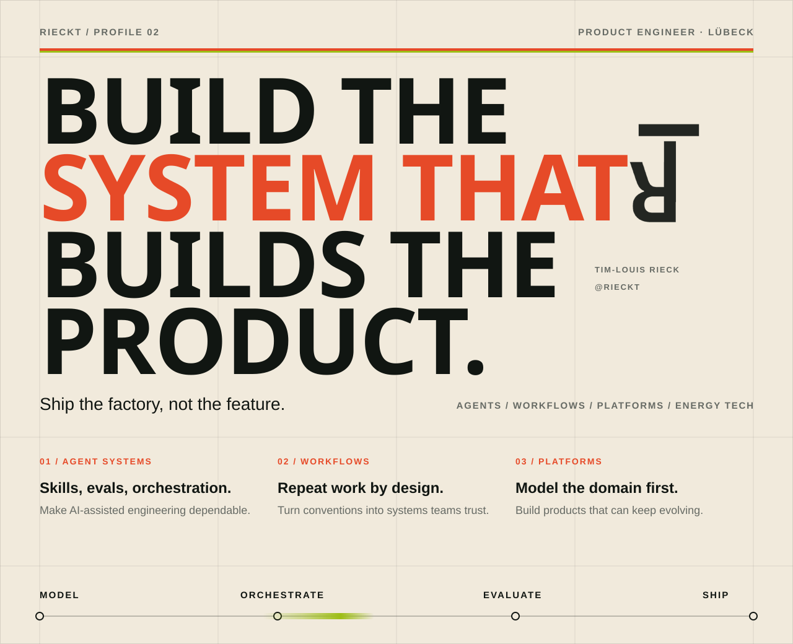

<picture>
  <source media="(prefers-color-scheme: dark) and (max-width: 600px)" srcset="./assets/profile-poster-mobile-dark.svg" />
  <source media="(prefers-color-scheme: light) and (max-width: 600px)" srcset="./assets/profile-poster-mobile-light.svg" />
  <source media="(prefers-color-scheme: dark)" srcset="./assets/profile-poster-dark.svg" />
  <source media="(prefers-color-scheme: light)" srcset="./assets/profile-poster-light.svg" />
  
</picture>

<p align="center">
  <a href="https://riecktm.de"><strong>riecktm.de</strong></a>
  &nbsp;·&nbsp;
  <a href="https://de.linkedin.com/in/tim-louis-rieck"><strong>LinkedIn</strong></a>
</p>

<details>
<summary><strong>About the work</strong></summary>
<br/>
I work on AI agent systems, reusable engineering workflows, and product platforms for complex operational domains, including energy technology. My bias is toward clear models, measurable behavior, and tooling that becomes more valuable each time it is reused.
</details>

<details>
<summary><strong>How this profile is built</strong></summary>
<br/>
This README is compiled from <a href="./profile/profile.json"><code>profile/profile.json</code></a> into four self-contained SVGs with embedded brand fonts, dedicated mobile layouts, dark and light themes, and reduced-motion support. It uses no external widgets or runtime APIs.

```sh
python3 scripts/build-profile.py
```
</details>
